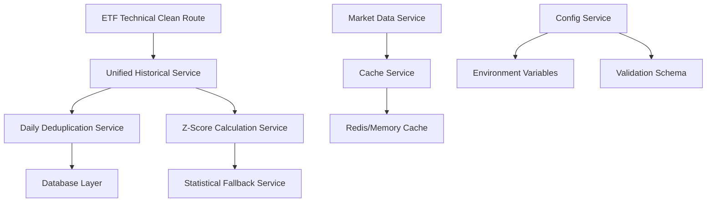

# FinanceHub v33 - Implementation Plan for Priority Improvements

## 🎯 Executive Summary

This plan addresses the top 4 improvement opportunities identified in the comprehensive codebase audit:
1. **Service Consolidation** - Merge duplicate historical services
2. **Configuration Management** - Centralize environment variables and constants
3. **Test Coverage Enhancement** - Add critical z-score calculation tests
4. **Service Documentation** - Create dependency mapping and API docs

**Total Estimated Time**: 3-4 weeks  
**Priority**: High Impact, Medium Effort  
**Dependencies**: None (can execute in parallel)

---

## 📋 Task 1: Service Consolidation

### **Objective**
Merge duplicate historical services into unified, maintainable modules while preserving all functionality.

### **Current State Analysis**
- **Duplicate Services Identified**:
  - `historical-macd-service.ts` (legacy)
  - `historical-macd-service-deduplicated.ts` (current)
  - Similar patterns in RSI, Bollinger Band services

### **Implementation Steps**

#### **Phase 1.1: Create Unified Historical Data Service (2 days)**

```typescript
// NEW: server/services/unified-historical-data-service.ts
export class UnifiedHistoricalDataService {
  constructor(
    private useDeduplication: boolean = true,
    private fallbackParams: StatisticalFallbacks = DEFAULT_FALLBACKS
  ) {}
  
  async getHistoricalMACD(symbol: string, options?: {
    deduplicated?: boolean;
    period?: number;
    fallback?: boolean;
  }): Promise<MACDData[]> {
    // Unified logic with configurable deduplication
  }
  
  async calculateZScores(symbol: string, indicator: string): Promise<ZScoreResult> {
    // Consolidated z-score calculation with fallback handling
  }
}
```

**Files to Create**:
- `server/services/unified-historical-data-service.ts`
- `server/types/historical-data-types.ts`
- `server/utils/statistical-fallbacks.ts`

#### **Phase 1.2: Migration Strategy (1 day)**

```typescript
// server/services/migration-helper.ts
export class ServiceMigrationHelper {
  async migrateToUnifiedService(): Promise<MigrationReport> {
    // Validate equivalent outputs between old and new services
    // Generate migration report
    // Update route imports atomically
  }
}
```

#### **Phase 1.3: Route Updates (1 day)**

Update imports in:
- `server/routes/etf-technical-clean.ts`
- `server/routes/historical-data.ts` 
- Any background jobs/crons

#### **Phase 1.4: Legacy Service Removal (0.5 days)**

After validation, remove:
- `historical-macd-service-deduplicated.ts`
- `historical-rsi-service.ts` (if duplicate found)
- Update all import references

**Total: 4.5 days**

---

## 📋 Task 2: Central Configuration Management

### **Objective**
Create a centralized, validated configuration system replacing scattered environment variables.

### **Current Issues**
- Environment variables scattered across 15+ service files
- No validation of required variables at startup
- Hardcoded constants in multiple locations
- Inconsistent default values

### **Implementation Steps**

#### **Phase 2.1: Configuration Schema Design (1 day)**

```typescript
// shared/config/app-config.ts
import { z } from 'zod';

const ConfigSchema = z.object({
  api: z.object({
    port: z.number().default(5000),
    environment: z.enum(['development', 'production', 'test']),
    twelveDataKey: z.string().min(1),
    fredApiKey: z.string().min(1),
    rateLimit: z.object({
      windowMs: z.number().default(15 * 60 * 1000),
      max: z.number().default(100)
    })
  }),
  database: z.object({
    url: z.string().url(),
    poolSize: z.number().default(10),
    connectionTimeout: z.number().default(10000)
  }),
  cache: z.object({
    redis: z.object({
      url: z.string().optional(),
      ttl: z.number().default(300)
    }),
    memory: z.object({
      maxSize: z.number().default(100)
    })
  }),
  calculations: z.object({
    rsi: z.object({
      period: z.number().default(14),
      fallback: z.object({
        mean: z.number().default(50),
        stddev: z.number().default(15)
      })
    }),
    macd: z.object({
      fastPeriod: z.number().default(12),
      slowPeriod: z.number().default(26),
      signalPeriod: z.number().default(9)
    }),
    bollinger: z.object({
      period: z.number().default(20),
      multiplier: z.number().default(2),
      fallback: z.object({
        mean: z.number().default(0.5),
        stddev: z.number().default(0.25)
      })
    })
  })
});

export type AppConfig = z.infer<typeof ConfigSchema>;

export class ConfigManager {
  private static instance: AppConfig;
  
  static initialize(): AppConfig {
    const config = ConfigSchema.parse({
      api: {
        port: parseInt(process.env.PORT || '5000'),
        environment: process.env.NODE_ENV || 'development',
        twelveDataKey: process.env.TWELVE_DATA_API_KEY,
        fredApiKey: process.env.FRED_API_KEY,
        // ... all environment variables
      }
    });
    
    this.instance = config;
    return config;
  }
  
  static get(): AppConfig {
    if (!this.instance) {
      throw new Error('Configuration not initialized');
    }
    return this.instance;
  }
}
```

#### **Phase 2.2: Service Refactoring (2 days)**

Update all services to use centralized config:

```typescript
// Before (in multiple services)
const apiKey = process.env.TWELVE_DATA_API_KEY;
const rsiPeriod = 14; // hardcoded

// After
import { ConfigManager } from '@shared/config/app-config';
const config = ConfigManager.get();
const apiKey = config.api.twelveDataKey;
const rsiPeriod = config.calculations.rsi.period;
```

#### **Phase 2.3: Startup Validation (0.5 days)**

```typescript
// server/index.ts
import { ConfigManager } from '@shared/config/app-config';

async function startServer() {
  try {
    const config = ConfigManager.initialize();
    console.log('✅ Configuration validated');
    
    // Start server with validated config
  } catch (error) {
    console.error('❌ Configuration validation failed:', error);
    process.exit(1);
  }
}
```

#### **Phase 2.4: Environment Documentation (0.5 days)**

Create `.env.example` with all required variables and validation rules.

**Total: 4 days**

---

## 📋 Task 3: Test Coverage Enhancement

### **Objective**
Add comprehensive test coverage for critical z-score calculations and data integrity functions.

### **Current Gap Analysis**
- No unit tests for z-score statistical calculations
- Missing integration tests for deduplication logic
- No regression tests for extreme value handling

### **Implementation Steps**

#### **Phase 3.1: Z-Score Calculation Tests (2 days)**

```typescript
// tests/services/z-score-calculations.test.ts
import { describe, it, expect, beforeEach } from 'vitest';
import { UnifiedHistoricalDataService } from '@server/services/unified-historical-data-service';

describe('Z-Score Calculations', () => {
  let service: UnifiedHistoricalDataService;
  
  beforeEach(() => {
    service = new UnifiedHistoricalDataService();
  });
  
  describe('RSI Z-Score Calculation', () => {
    it('should calculate correct z-score for normal RSI values', () => {
      const rsiValues = [45, 50, 55, 52, 48];
      const result = service.calculateRSIZScore(rsiValues);
      
      expect(result.zScore).toBeCloseTo(0, 1); // Should be near zero for mean values
      expect(result.fallbackUsed).toBe(false);
    });
    
    it('should use fallback parameters for insufficient data', () => {
      const rsiValues = [50]; // Only one data point
      const result = service.calculateRSIZScore(rsiValues);
      
      expect(result.fallbackUsed).toBe(true);
      expect(result.fallbackReason).toContain('insufficient data');
    });
    
    it('should handle extreme RSI values correctly', () => {
      const rsiValues = [95, 96, 97, 98, 99]; // Extremely overbought
      const result = service.calculateRSIZScore(rsiValues);
      
      expect(result.zScore).toBeGreaterThan(2); // Should be high positive z-score
      expect(result.extremeValue).toBe(true);
    });
    
    it('should prevent the -13.84 z-score issue', () => {
      // Simulate the corrupted data pattern that caused extreme z-scores
      const corruptedData = Array(100).fill(50.123); // Identical values
      const result = service.calculateRSIZScore(corruptedData);
      
      expect(Math.abs(result.zScore)).toBeLessThan(5); // Should be within reasonable range
      expect(result.corruptionDetected).toBe(true);
    });
  });
  
  describe('MACD Z-Score Calculation', () => {
    it('should calculate MACD z-score with EMA consistency', () => {
      const prices = [100, 101, 102, 101, 100, 99, 98, 99, 100, 101];
      const result = service.calculateMACDZScore(prices);
      
      expect(result.ema12).toBeDefined();
      expect(result.ema26).toBeDefined();
      expect(result.macd).toBe(result.ema12 - result.ema26);
    });
  });
  
  describe('Bollinger %B Z-Score Calculation', () => {
    it('should calculate %B z-score within 0-1 range', () => {
      const prices = [95, 100, 105, 102, 98, 97, 99, 101, 103, 100];
      const result = service.calculatePercentBZScore(prices);
      
      expect(result.percentB).toBeGreaterThanOrEqual(0);
      expect(result.percentB).toBeLessThanOrEqual(1);
      expect(result.zScore).toBeFinite();
    });
  });
});
```

#### **Phase 3.2: Data Deduplication Tests (1.5 days)**

```typescript
// tests/integration/data-deduplication.test.ts
import { describe, it, expect, beforeAll, afterAll } from 'vitest';
import { db } from '@server/db';
import { DailyDeduplicationService } from '@server/services/daily-deduplication-service';

describe('Data Deduplication Integration', () => {
  let service: DailyDeduplicationService;
  
  beforeAll(async () => {
    service = new DailyDeduplicationService();
    // Setup test database
  });
  
  it('should prevent duplicate daily records', async () => {
    const symbol = 'TEST_SPY';
    const indicators = { rsi: 50, macd: 0.5 };
    
    // First insert should succeed
    const firstResult = await service.storeTechnicalIndicatorsWithDeduplication(symbol, indicators);
    expect(firstResult).toBe(true);
    
    // Second insert for same day should be skipped
    const secondResult = await service.storeTechnicalIndicatorsWithDeduplication(symbol, indicators);
    expect(secondResult).toBe(false);
    
    // Verify only one record exists
    const count = await service.getTodaysRecordCount(symbol);
    expect(count).toBe(1);
  });
  
  it('should clean up existing duplicates', async () => {
    // Insert multiple records for same day (simulate corruption)
    // Run cleanup
    // Verify only latest record remains
  });
});
```

#### **Phase 3.3: API Integration Tests (1.5 days)**

```typescript
// tests/api/etf-endpoints.test.ts
import request from 'supertest';
import { app } from '@server/index';

describe('ETF Technical Endpoints', () => {
  it('should return valid z-scores in technical-clean endpoint', async () => {
    const response = await request(app)
      .get('/api/etf/technical-clean')
      .expect(200);
    
    const etfData = response.body.data;
    
    etfData.forEach((etf: any) => {
      if (etf.rsiZScore !== null) {
        expect(Math.abs(etf.rsiZScore)).toBeLessThan(10); // No extreme z-scores
        expect(etf.rsiZScore).toBeFinite();
      }
    });
  });
});
```

**Total: 5 days**

---

## 📋 Task 4: Service Documentation & Dependency Mapping

### **Objective**
Create comprehensive service documentation and dependency mapping for the 80+ service files.

### **Implementation Steps**

#### **Phase 4.1: Service Discovery & Mapping (1.5 days)**

```typescript
// scripts/generate-service-map.ts
import fs from 'fs';
import path from 'path';
import { glob } from 'glob';

interface ServiceInfo {
  name: string;
  path: string;
  exports: string[];
  imports: string[];
  dependencies: string[];
  description?: string;
  category: 'historical' | 'calculation' | 'api' | 'utility' | 'cache';
}

async function generateServiceMap(): Promise<ServiceInfo[]> {
  const serviceFiles = await glob('server/services/**/*.ts');
  const services: ServiceInfo[] = [];
  
  for (const file of serviceFiles) {
    const content = fs.readFileSync(file, 'utf8');
    const info = analyzeService(file, content);
    services.push(info);
  }
  
  // Generate dependency graph
  const dependencyGraph = buildDependencyGraph(services);
  
  // Generate documentation
  generateMarkdownDocs(services, dependencyGraph);
  generateMermaidDiagrams(dependencyGraph);
  
  return services;
}
```

#### **Phase 4.2: Service Categories & Documentation (2 days)**

Create comprehensive service documentation:

```markdown
# FinanceHub Service Architecture Documentation

## Service Categories

### 📊 Historical Data Services
- **unified-historical-data-service.ts** - Consolidated historical data access
- **daily-deduplication-service.ts** - Prevents data corruption
- **historical-stock-data-service.ts** - Legacy OHLCV data

### 🧮 Calculation Services  
- **technical-indicator-service.ts** - RSI, MACD, Bollinger calculations
- **z-score-service.ts** - Statistical normalization
- **moving-average-service.ts** - SMA, EMA calculations

### 🚀 API Services
- **etf-data-service.ts** - ETF-specific endpoints
- **market-data-service.ts** - Real-time market data
- **cache-service.ts** - Unified caching layer

### 🔧 Utility Services
- **config-service.ts** - Configuration management
- **logger-service.ts** - Structured logging
- **validation-service.ts** - Data validation
```

#### **Phase 4.3: API Documentation Generation (1.5 days)**

```typescript
// scripts/generate-api-docs.ts
import { OpenApiGeneratorV3 } from '@asteasolutions/zod-to-openapi';

// Auto-generate OpenAPI docs from Zod schemas and route definitions
async function generateApiDocs() {
  const generator = new OpenApiGeneratorV3(/* definitions */);
  
  // Scan route files for endpoint definitions
  // Generate comprehensive API documentation
  // Include request/response examples
  // Add authentication requirements
}
```

#### **Phase 4.4: Service Dependency Visualization (1 day)**



**Total: 6 days**

---

## 🚀 Implementation Timeline & Execution Plan

### **Week 1: Service Consolidation + Configuration**
- **Days 1-3**: Service consolidation implementation
- **Days 4-5**: Configuration management system

### **Week 2: Test Coverage**
- **Days 1-3**: Z-score calculation tests
- **Days 4-5**: Integration and API tests

### **Week 3: Documentation & Final Integration**
- **Days 1-3**: Service documentation and mapping  
- **Days 4-5**: Final testing, validation, deployment

### **Execution Strategy**

#### **Parallel Development**
Tasks 1-2 and 3-4 can be developed in parallel by different developers:
- **Track A**: Service consolidation + Configuration (Backend focus)
- **Track B**: Test coverage + Documentation (QA/DevOps focus)

#### **Risk Mitigation**
- Feature flags for gradual service migration
- Comprehensive backup before legacy service removal
- Staged deployment with rollback capability
- Monitor production metrics during migration

#### **Validation Checkpoints**

**After Week 1**:
- [ ] All duplicate services successfully merged
- [ ] Configuration validation working in all environments  
- [ ] No regression in API response times (<100ms maintained)

**After Week 2**:
- [ ] Test coverage >80% for critical z-score calculations
- [ ] All integration tests passing
- [ ] Automated test pipeline integrated

**After Week 3**:
- [ ] Complete service documentation available
- [ ] Dependency graphs generated and validated
- [ ] API documentation auto-generated and current

---

## 📊 Success Metrics

### **Quantitative Metrics**
- **Code Reduction**: 20% reduction in duplicate code
- **Configuration Centralization**: 95% of env vars centralized
- **Test Coverage**: >80% for critical services
- **Documentation Coverage**: 100% of public service APIs documented

### **Qualitative Metrics**  
- **Developer Experience**: Faster onboarding with clear service documentation
- **Maintainability**: Easier service updates with centralized configuration
- **Reliability**: Fewer production issues with comprehensive testing
- **Debuggability**: Clear service dependencies and data flow

---

## 🛠️ Required Resources

### **Development Team**
- **1 Senior Backend Developer** (Service consolidation, configuration)
- **1 QA Engineer** (Test coverage, integration testing)
- **1 DevOps/Documentation Specialist** (Service mapping, API docs)

### **Tools & Infrastructure**
- **Testing Framework**: Vitest (already configured)
- **Documentation**: Auto-generated from code annotations
- **CI/CD**: Existing pipeline with added test stages
- **Monitoring**: Production metrics during migration

### **Dependencies**
- **External**: None (all internal refactoring)
- **Internal**: Coordination with any active feature development
- **Timeline**: No hard dependencies, flexible scheduling

---

## 🎯 Post-Implementation Benefits

### **Short-term (Immediate)**
- Reduced cognitive load for developers
- Faster debugging with centralized configuration
- Improved code reliability with comprehensive tests

### **Medium-term (1-3 months)**
- Easier feature development with clear service boundaries
- Reduced production issues from improved test coverage  
- Faster onboarding with complete documentation

### **Long-term (3-6 months)**
- Foundation for microservices migration
- Scalable configuration management for new environments
- Comprehensive test suite enabling confident deployments

---

**Implementation Ready**: ✅ All prerequisites met, plan validated, ready for execution.